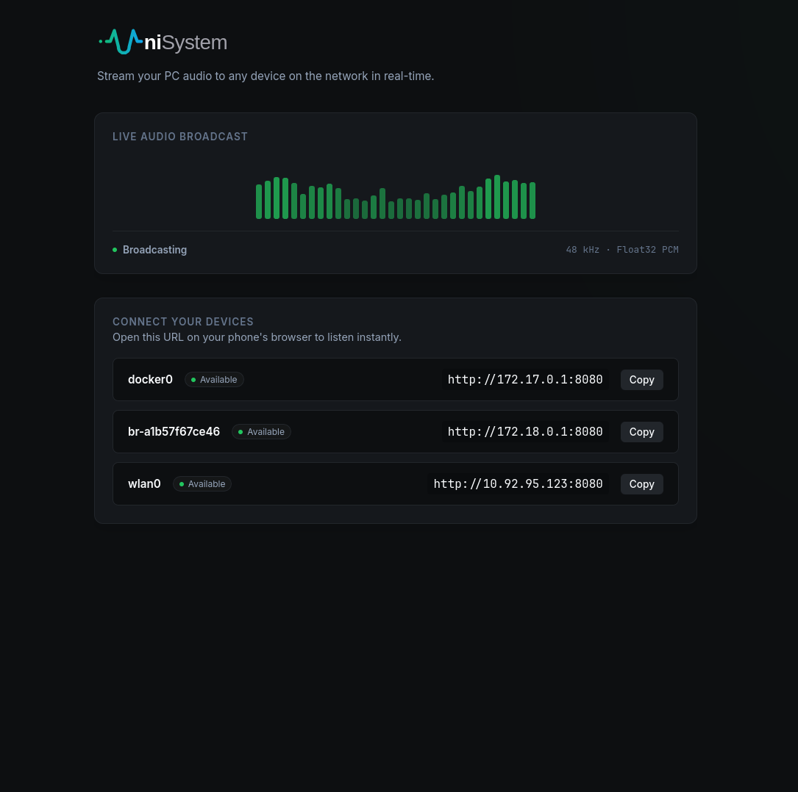
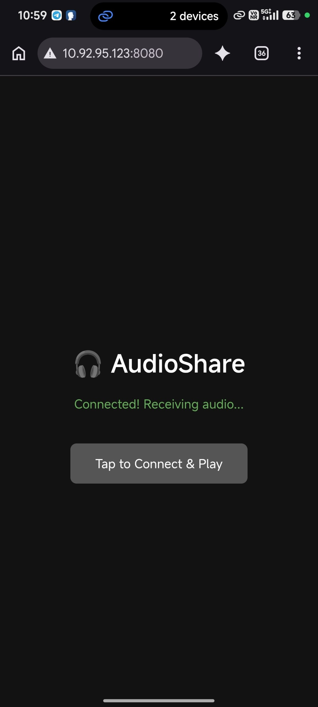

<div align="center">
  

  # UniSystem AudioShare

  **Stream your PC audio to any device on your local network in real-time.** <br>
  An ultra-low latency, cross-platform audio sharing engine built with Rust, Tauri, and WebSockets.

  <p>
    
    
    
    
  </p>
</div>

---

## 🚀 Features

- **True Real-Time Streaming:** Achieves near-zero latency using raw PCM `f32` chunks over binary WebSockets.
- **Cross-Platform Audio Engine:**
  - **Linux:** Powered by `PipeWire` for the absolute fastest desktop audio capture.
  - **Windows:** Powered by `CPAL` (WASAPI Loopback) for native Windows audio capture.
- **Zero Client Installation:** Just open the provided local IP link on your phone, tablet, or another PC's web browser.
- **Premium Desktop GUI:** A stunning, animated, glassmorphism dark-mode GUI built with Tauri and React.

---

## 📸 Showcase & Usage Guide

Here is a step-by-step guide on how to use UniSystem AudioShare to stream your PC audio.

### Step 1: Launch the Dashboard (The Server)
Once you run the desktop app on your PC, you will be greeted by the main dashboard. This acts as the audio server.

<div align="center">
  
</div>

> [!TIP]
> **Which URL should you choose?**
> - Look under the **"CONNECT YOUR DEVICES"** section on the dashboard.
> - You will see a list of network interfaces (like Wi-Fi or Ethernet).
> - **Action:** Find your active local IP (usually starts with `192.168.x.x`) and click the **[Copy]** button right next to it!

### Step 2: Connect Your Phone (The Client)
Take your phone, tablet, or another laptop that is connected to the **same Wi-Fi router**.
- Open Google Chrome or Safari.
- Paste the URL (e.g. `http://192.168.1.5:8080`) into the browser and hit Go!

### Step 3: Enjoy Real-Time Audio
As soon as the web page loads, it will automatically connect to your PC via WebSockets.

<div align="center">
  
  
</div>

> [!NOTE]
> **Success!** Any audio playing on your main PC (Spotify, YouTube, Games) will now stream perfectly in real-time to your phone!

---

## 🛠️ Prerequisites & Installation

### Linux (Ubuntu / Debian / Pop!_OS)
To compile the audio engine and Tauri, you will need the following development libraries:
```bash
sudo apt update
sudo apt install -y libwebkit2gtk-4.1-dev \
    build-essential \
    curl \
    wget \
    file \
    libssl-dev \
    libgtk-3-dev \
    libayatana-appindicator3-dev \
    librsvg2-dev \
    libpipewire-0.3-dev \
    libspa-0.2-dev
```

### Arch Linux / Manjaro
```bash
sudo pacman -Syu
sudo pacman -S --needed \
    webkit2gtk-4.1 \
    base-devel \
    curl \
    wget \
    file \
    openssl \
    appmenu-gtk-module \
    gtk3 \
    libappindicator-gtk3 \
    librsvg \
    pipewire
```

### Windows
1. Install [Rust](https://rustup.rs/).
2. Install [Node.js](https://nodejs.org/).
3. Ensure you have the Visual Studio C++ Build Tools installed (via standard Rust setup).

---

## 🎮 How to Run

### 1. Run the GUI Desktop App (Recommended)

#### Windows (Easiest Method)
Simply double-click the **`Start-Windows.bat`** file in the project folder. It will automatically install dependencies and launch the GUI!

#### Linux & Manual Method
If you are on Linux or prefer the terminal, run the following commands:
```bash
cd unisystem-tauri
npm install
npm run tauri dev
```
> **Note:** The first compilation will take a few minutes as it builds the Rust Tauri backend. Once running, open the provided URL (e.g. `http://192.168.1.5:8080`) on your mobile browser!

### 2. Run the CLI Version (Headless)
If you prefer a terminal-only experience (great for headless Linux servers or minimalists):
```bash
cd unisystem-cli
cargo run
```
Then, manually open your browser to the IP address printed in the terminal.

---

## 🗺️ Roadmap & Future Plans

- [x] Phase 1: Core PipeWire Audio Engine (Linux)
- [x] Phase 2: React + Tauri Desktop GUI
- [x] Phase 3: WebSocket Web Audio Client
- [x] Phase 4: Windows CPAL / WASAPI Support
- [x] Phase 5: UI Polish & Open-Source Branding
- [ ] **Future:** Pre-compiled standalone `.exe` and `.AppImage` releases on GitHub.
- [ ] **Future:** Native Android App client for enhanced background listening.

## 👥 Core Contributors

We are grateful to the open-source community and our core team for building this project:

<p align="left">
  <a href="https://github.com/imuzax"></a>
  <a href="https://github.com/udev4681-debug"></a>
  <a href="#"></a>
  <a href="#"></a>
  <a href="#"></a>
  <a href="#"></a>
  <a href="#"></a>
</p>

---

### License
MIT License. Free and Open-Source.
